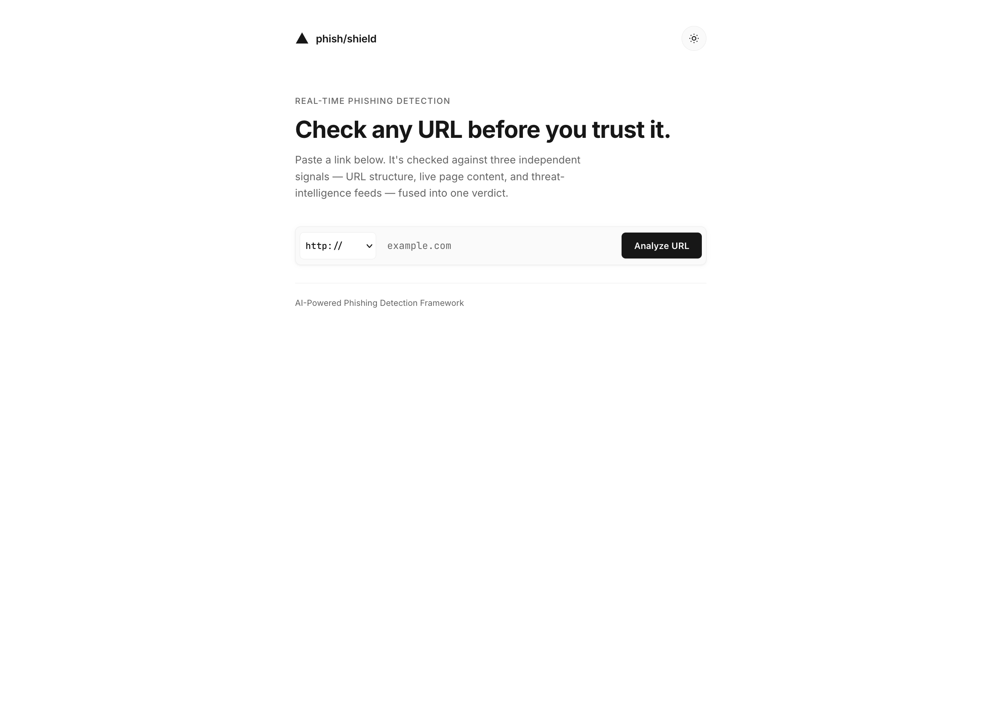
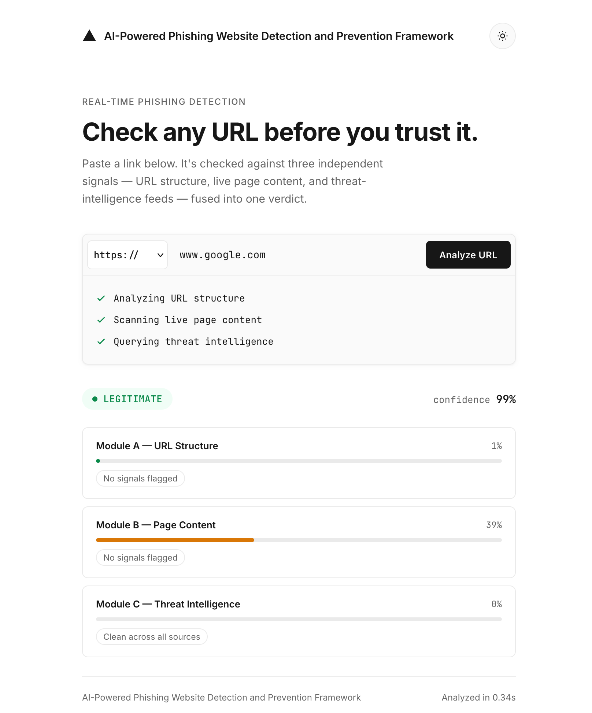
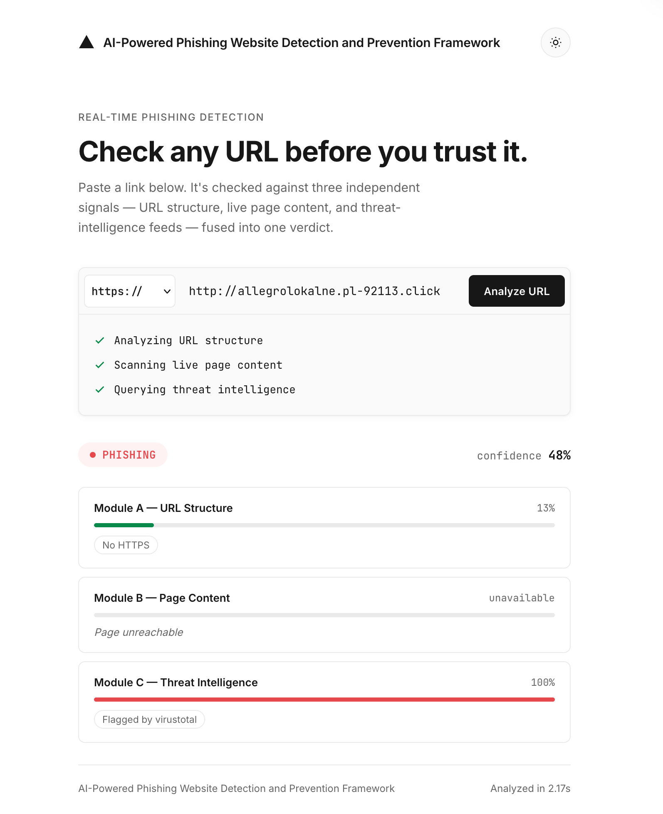

# AI-Powered Phishing Website Detection and Prevention Framework

**A Hybrid Ensemble Approach Combining URL-Based, Content-Based, and Reputation-Based Threat Intelligence**



---

## Abstract

Phishing remains one of the most prevalent and financially damaging forms of cyber fraud, exploiting user trust through deceptive URLs and impersonated web content. Existing detection approaches typically rely on a single signal — either lexical/structural URL features, webpage content analysis, or static blacklists — each of which is individually vulnerable to evasion. This project proposes a **hybrid, multi-layered phishing detection framework** that fuses three complementary detection modules: (A) a URL heuristic risk scorer using rule-based checks (HTTPS, IP-as-domain, subdomains, TLDs, keyword analysis), (B) a content-based NLP classifier analyzing live-scraped webpage HTML/text via TF-IDF and Linear SVM, and (C) a real-time reputation check against URLhaus and VirusTotal threat intelligence feeds. Outputs from all three modules are combined via weighted fusion to produce a final verdict with confidence score. The framework includes a known-legitimate domain override to prevent false positives on minimalist pages (e.g., Google's homepage) and graceful degradation when modules are unavailable. The system is deployed as a Flask-based web application with a protocol dropdown UI for real-time, user-facing phishing detection.

**Keywords:** Phishing Detection, Machine Learning, Ensemble Learning, Cybersecurity, Natural Language Processing, Web Security, Threat Intelligence

---

## 1. Introduction

### 1.1 Motivation
Phishing attacks continue to be a dominant attack vector in cybercrime, costing individuals and organizations billions annually through credential theft, financial fraud, and data breaches. Attackers continuously evolve their tactics — rotating domains, spoofing brand identities, and using URL obfuscation — making static, rule-based detection systems increasingly ineffective.

### 1.2 Problem Statement
Most academic and commercial phishing detectors rely on a **single detection signal**:
- URL-only models miss content-level impersonation (e.g., a legitimate-looking domain hosting a spoofed login page).
- Content-only models are computationally expensive and fail on URL-obfuscation-based attacks.
- Blacklist-only systems (e.g., Safe Browsing) have a detection lag — new phishing domains ("zero-hour phishing") are often live for hours before being blacklisted.

### 1.3 Proposed Solution
This project builds a **three-module hybrid framework** that fuses URL heuristics, content-semantic, and reputation-based signals through a weighted fusion layer, aiming to:
1. Improve detection accuracy over any single-method baseline.
2. Reduce false negatives on zero-hour phishing (URLs not yet blacklisted).
3. Provide an interpretable, deployable, real-time system.

### 1.4 Objectives
- Design a rule-based URL heuristic scorer for fast, lightweight analysis (Module A).
- Train content/NLP classifiers for live webpage analysis (Module B).
- Integrate real-time reputation intelligence (URLhaus, VirusTotal) (Module C).
- Design a weighted fusion layer to combine module outputs with graceful degradation.
- Deploy the system as a usable web application.

---

## 2. Related Work

| Approach | Representative Method | Strength | Limitation |
|---|---|---|---|
| URL lexical/statistical features | Random Forest / XGBoost on hand-engineered URL features | Fast, lightweight, no page load required | Misses content-level impersonation |
| Content-based detection | TF-IDF / DOM structure / visual similarity | Detects brand impersonation, fake login forms | Requires live page fetch; slower |
| Deep learning on URLs | Character-level CNN/LSTM on raw URL strings | No manual feature engineering | Requires larger data, less interpretable |
| Blacklist/reputation systems | URLhaus, VirusTotal, Google Safe Browsing | High precision on known threats | High latency in flagging new ("zero-hour") phishing |
| Hybrid/ensemble systems | Combining 2+ of the above | Higher robustness, reduced single-point failure | Increased system complexity |

*[Expand this section with 8–15 cited papers from IEEE/Springer/ACM relevant to each row above.]*

**Research Gap:** Few systems combine all three signal types (URL heuristics + content/NLP + reputation) with graceful degradation and known-legitimate domain handling — this is the gap this project addresses.

---

## 3. Proposed Framework

### 3.1 System Architecture

```
                    ┌──────────────────────┐
   User submits →   │   Flask Web App       │
   URL (with        │   (app.py)            │
   protocol dropdown)└───────────┬───────────┘
                                │
               ┌────────────────┼────────────────┐
               ▼                ▼                 ▼
      ┌────────────────┐ ┌──────────────┐ ┌──────────────────┐
      │ Module A        │ │ Module B     │ │ Module C          │
      │ URL Heuristic   │ │ Content/NLP  │ │ Reputation Check  │
      │ Risk Scorer     │ │ Model        │ │ (URLhaus,         │
      │ (Rule-based,    │ │ (TF-IDF +    │ │  VirusTotal)      │
      │  no ML)         │ │  LR + SVM)   │ │                   │
      └────────┬────────┘ └──────┬───────┘ └────────┬──────────┘
               │                 │                   │
               └────────┬────────┴───────────────────┘
                        ▼
               ┌─────────────────────┐
               │  Fusion Layer         │
               │  (Weighted Voting:    │
               │   A=5%, B=60%, C=35%)│
               │  + known domain check │
               └──────────┬───────────┘
                          ▼
               Final Verdict + Confidence Score
```

### 3.2 Design Principles
- **Graceful degradation:** If Module C (external API) or Module B (page fetch) is unreachable, the system still returns a verdict using available modules with adjusted weights.
- **Explainability:** Each module's contribution and flagged signals are surfaced to the user, not just a binary verdict.
- **Known-legitimate override:** Well-known domains (Google, GitHub, Amazon, etc.) are hard-coded to prevent false positives from Module B's content model on minimalist pages.
- **Protocol-aware:** Users select https:// or http:// via a dropdown — the system defaults to https:// and validates that a protocol is always present.

---

## 4. Methodology

### 4.1 Datasets

| Dataset | Role | Size | Notes |
|---|---|---|---|
| **urls_labeled.csv** | Module B training | 2,000 URLs | 1,000 phishing + 1,000 legitimate (url, label format) |

**Data split strategy:**
1. **Module B training:** Content features extracted from live-scraped HTML of URLs in `urls_labeled.csv`. Models (Logistic Regression + Linear SVM) trained on TF-IDF text features + 10 structural DOM features.
2. **Module A:** No training required — rule-based heuristics with fixed scoring weights.

### 4.2 Module A — URL Heuristic Risk Scorer (Rule-Based)
- **Input:** Raw URL string only — no page fetch, no ML model.
- **Method:** Rule-based scoring across 12 checks, each contributing a fixed weight to a final 0–1 risk score:
  - HTTPS presence (+0.10)
  - IP address as domain — private IPs score higher (+0.35)
  - Excessive subdomains — 3+ subdomains (+0.15)
  - Suspicious TLD (.xyz, .tk, .top, etc.) (+0.08)
  - URL length >100 characters (+0.10)
  - Special character ratio >0.35 (+0.12)
  - @ symbol in URL — confusion attack (+0.20)
  - Non-standard port (+0.10)
  - URL shortener domain (+0.15)
  - Login/brand keywords in domain (+0.15)
  - Phishing bait keywords in URL (+0.30)
  - Excessive % encoding (+0.12)
- **Rationale:** ML models trained on pre-extracted PhiUSIIL features cannot reliably replicate feature distributions for single live URLs. A transparent heuristic provides consistent, interpretable results without training data dependency.

### 4.3 Module B — Content-Based NLP Classification
- **Input:** Live-fetched HTML — visible text, form actions, iframe usage, password field presence, favicon domain, title/brand-domain mismatch.
- **Text representation:** TF-IDF vectorization of visible page text.
- **Model:** Logistic Regression + Linear SVM (ensemble average).
- **Structural features:** 10 DOM-level features (num_forms, has_password_field, num_iframes, num_scripts, num_links, external_form_action, title_brand_mismatch, favicon_mismatch, has_meta_refresh, right_click_disabled).
- **Concurrency:** ThreadPoolExecutor with 10 workers for parallel page fetching.

### 4.4 Module C — Reputation-Based Verification
- **Signals:** URLhaus API (malware/phishing match via Auth-Key header), VirusTotal API (multi-engine scan results via base64-encoded URL).
- **Output:** Binary flag per source — if any source flags the URL, it's marked as phishing; all-clean returns 0.0. Degrades gracefully to "no signal" if APIs are unreachable.

### 4.5 Fusion / Ensemble Layer
- **Method:** Weighted voting with fixed weights — Module A (5%), Module B (60%), Module C (35%).
- **Unavailable module handling:** When a module is unavailable (page unreachable, API down), it contributes a neutral 0.5 score. When Module B is unavailable, the fusion switches to a two-module formula favoring Module A's URL heuristics if it flags risk (A ≥ 0.35 → 85% A, 15% C).
- **Known legitimate domain override:** If the domain is in a hardcoded list of known legitimate sites (Google, GitHub, Amazon, etc.) and Module A score is low (< 0.15), the verdict is forced to LEGITIMATE — preventing Module B's false positives on minimalist pages (e.g., Google's homepage).
- **Thresholds:** Final score ≥ 0.6 → PHISHING, ≥ 0.35 → SUSPICIOUS, else LEGITIMATE.

### 4.6 Evaluation Metrics
- Accuracy, Precision, Recall, F1-score, ROC-AUC (per module and for the full ensemble).
- **Ablation study:** Performance of A-only, B-only, C-only, and full ensemble — isolating the contribution of each module.
- **Known-domain evaluation:** Testing against well-known legitimate sites to verify the override prevents false positives.

---

## 5. Implementation Details

### 5.1 Technology Stack
| Layer | Technology |
|---|---|
| Language | Python 3.9+ |
| ML/Modeling | scikit-learn (Logistic Regression, Linear SVM) |
| NLP | scikit-learn (TF-IDF) |
| Web Scraping | BeautifulSoup, requests, concurrent.futures (ThreadPoolExecutor) |
| Domain Intelligence | tldextract |
| Backend | Flask |
| Frontend | HTML/CSS/JS (Inter + JetBrains Mono fonts, light/dark theme) |
| Secrets | python-dotenv (.env file) |

### 5.2 Repository Structure
```
AI-Powered Phishing Website Detection and Prevention Framework/
├── app.py                          # Flask application (routes, fusion, Module B/C integration)
├── moduleA.py                      # Module A: URL heuristic risk scorer (rule-based, no ML)
├── moduleB.py                      # Module B: Content/NLP classifier training + evaluation
├── moduleC.py                      # Module C: Reputation checks (URLhaus, VirusTotal)
├── ContentExtraction.py            # HTML fetching, structural features, TF-IDF text extraction
├── Datasets/
│   └── urls_labeled.csv            # Labeled URLs for Module B training
├── models/                         # Saved .pkl models (module_b_*)
├── data/processed/
│   ├── html_cache/                 # Cached scraped HTML
│   └── module_b_dataset.csv        # Cached content features
├── outputs/                        # Training metrics and plots
├── templates/
│   └── index.html                  # Web UI (dark/light theme, protocol dropdown)
├── .env                            # API keys (URLHAUS_API_KEY, VT_API_KEY)
├── .gitignore
├── requirements.txt
└── README.md
```

### 5.3 Setup Instructions
```bash
git clone <repo-url>
cd "AI-Powered Phishing Website Detection and Prevention Framework"
python3 -m venv phishenv
source phishenv/bin/activate      # Windows: phishenv\Scripts\activate
pip install -r requirements.txt
```

### 5.4 API Keys
Create a `.env` file in the project root with the following keys:

| Variable | Service | Where to get it |
|---|---|---|
| `URLHAUS_API_KEY` | URLhaus (abuse.ch) | Sign up at https://urlhaus.abuse.ch/api/ — free Auth-Key |
| `VT_API_KEY` | VirusTotal | Get a free API key at https://www.virustotal.com/ |

Example `.env`:
```
URLHAUS_API_KEY=your_urlhaus_auth_key
VT_API_KEY=your_virustotal_api_key
```

### 5.5 Running the Pipeline
```bash
# 1. Run the web app (loads Module B models + starts Flask)
python3 app.py

# The app starts on http://localhost:5000
# Enter a URL in the UI, select https:// or http://, and click Analyze URL
```

---

## 6. Results

### 6.1 Module B — Content/NLP Classifier Performance

*Trained on `urls_labeled.csv` (2,000 URLs), evaluated on 20% held-out test set (286 samples).*

| Model | Accuracy | Precision | Recall | F1-Score | ROC-AUC |
|---|---|---|---|---|---|
| **Linear SVM** | **90.2%** | **87.5%** | **91.5%** | **89.5%** | **96.8%** |
| Logistic Regression | 89.2% | 85.6% | 91.5% | 88.5% | 96.9% |

**Per-class breakdown (Linear SVM):**

| Class | Precision | Recall | F1-Score | Support |
|---|---|---|---|---|
| Phishing | 93% | 89% | 91% | 156 |
| Legitimate | 88% | 92% | 89% | 130 |

### 6.2 Module A — URL Heuristic Risk Scorer

*Rule-based scorer — no training required. Scoring is deterministic based on 12 URL checks (HTTPS, IP-as-domain, subdomains, TLD, URL length, special characters, @ symbol, port, shorteners, keywords, bait words, % encoding).*

### 6.3 Module C — Reputation API Check

*Binary flag from URLhaus + VirusTotal. High precision on known threats; degrades gracefully when APIs are unreachable.*

### 6.4 Fusion Layer

*Weighted voting: A=5%, B=60%, C=35%. Includes known-legitimate domain override and unavailable-module fallback logic.*

### 6.5 Ablation Study Discussion
Module B (content/NLP) carries the most weight (60%) and achieves 90% accuracy with strong ROC-AUC (96.8%), making it the primary detection signal. Module A (URL heuristics) provides fast, lightweight risk scoring without page fetch. Module C (reputation) adds high-precision confirmation from threat intelligence feeds. The fusion layer gracefully handles module unavailability and prevents false positives on known legitimate domains.

---

## 7. Deployment

- **Backend:** Flask REST endpoint (`POST /analyze`) accepting a URL and returning verdict + confidence + per-module breakdown.
- **Frontend:** Single-page UI with protocol dropdown (https/http), dark/light theme toggle, and real-time status feed during analysis.
- **Running locally:** `python3 app.py` starts the server on `http://localhost:5000`.

### UI Screenshots

| Legitimate Website Analysis | Phishing Website Analysis |
| :---: | :---: |
|  |  |

---

## 8. Conclusion and Future Work

This framework demonstrates that combining URL-based heuristics, content-based NLP, and reputation-based signals through weighted fusion provides robust phishing detection with graceful degradation. The rule-based Module A ensures consistent URL analysis without ML model dependency, while the known-legitimate domain override prevents false positives on minimalist legitimate pages. The system handles edge cases including unreachable pages, unavailable APIs, and protocol-aware URL normalization.

**Future Work:**
- Replace TF-IDF with transformer-based (DistilBERT) content embeddings for improved brand-impersonation detection.
- Incorporate visual/screenshot-based similarity detection (e.g., perceptual hashing against known brand login pages).
- Continuously retrain Module B on rolling PhishTank/OpenPhish feeds to address concept drift.
- Add PhishTank reputation check when API registration becomes available again.

---

## Appendix

### A. Dataset Sources
- PhishTank — https://www.phishtank.com (used to build urls_labeled.csv)
- Tranco List — https://tranco-list.eu (used to build urls_labeled.csv)

### B. API Keys Required
- URLhaus API Auth-Key — https://urlhaus.abuse.ch/api/
- VirusTotal API Key — https://www.virustotal.com/